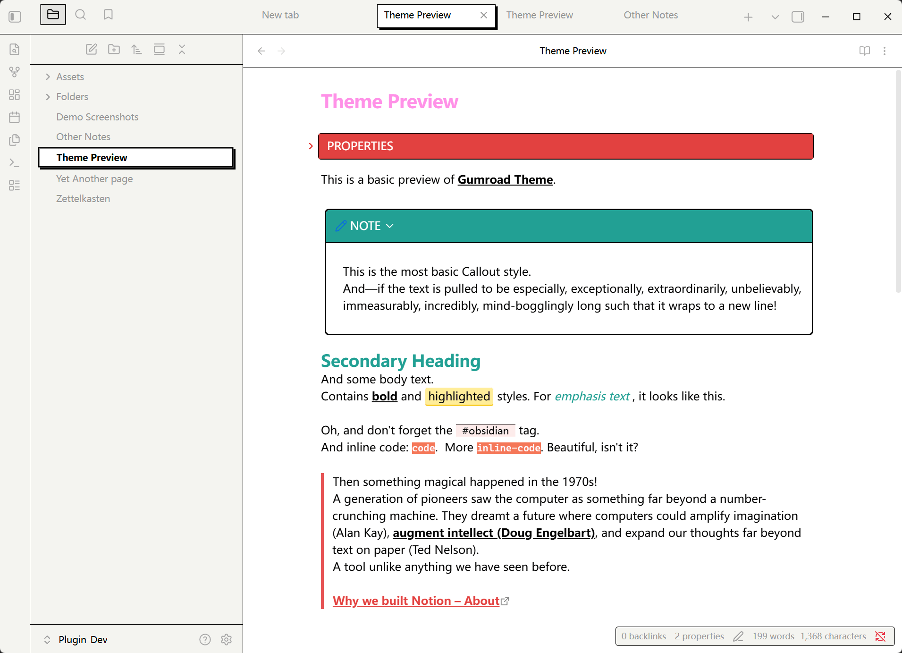
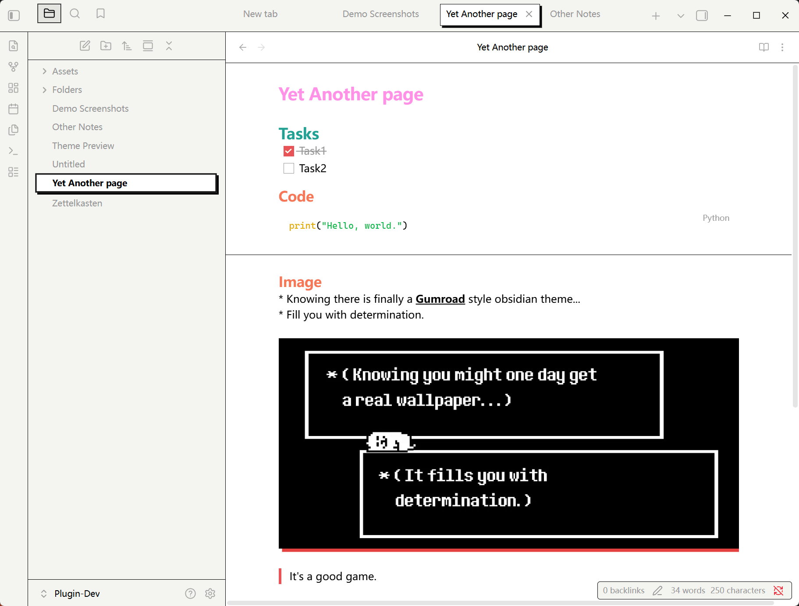
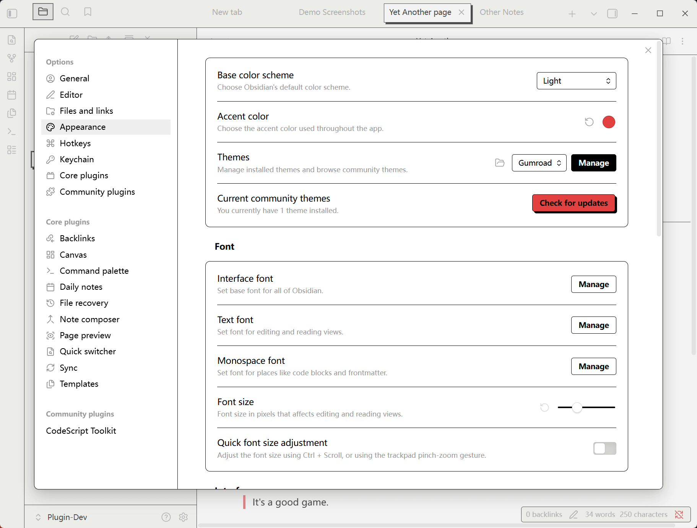
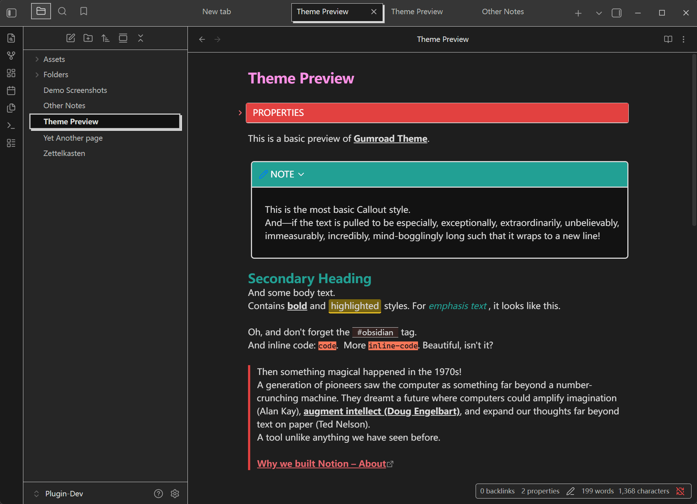
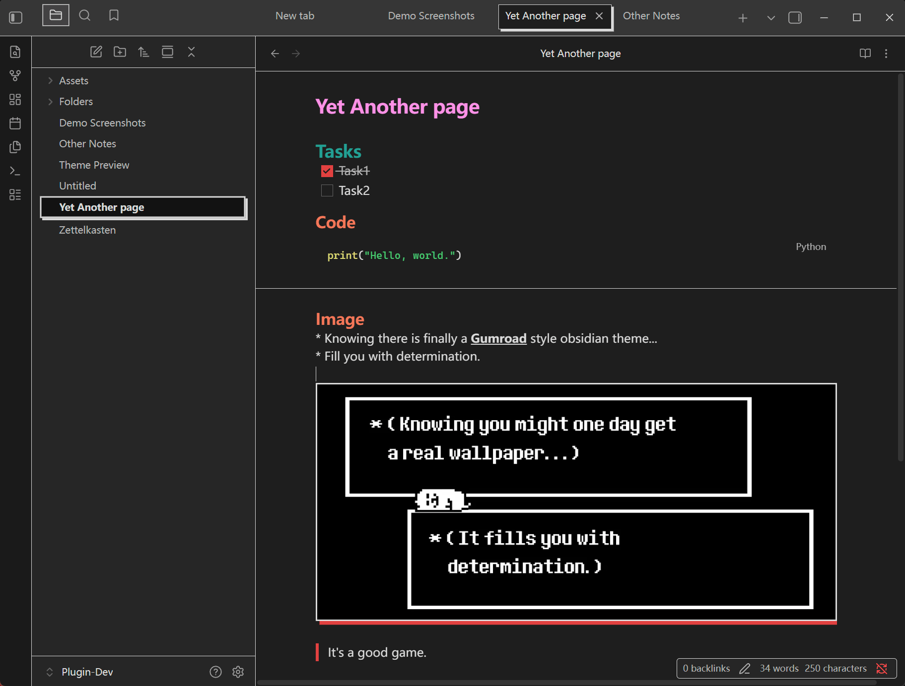
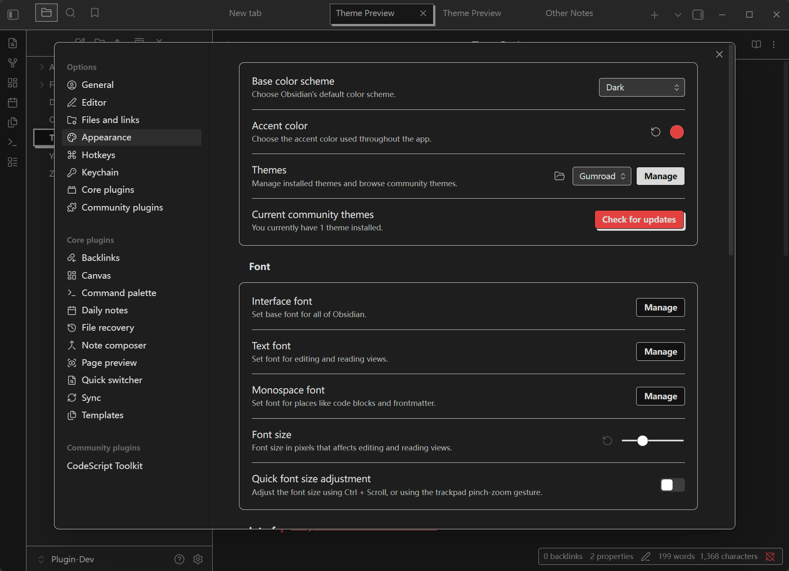

## Obsidian Gumroad Theme

This is a custom theme for [Obsidian](https://obsidian.md/), inspired by the clean and modern design of the [Gumroad](https://gumroad.com/) website. The theme uses custom CSS to bring a minimalist, professional, and visually appealing look to your Obsidian notes, closely resembling the Gumroad style.

> [!warning]
> This theme is not affiliated with or endorsed by Gumroad. It is a fan-made project created for personal use and shared with the Obsidian community.  
> Additionally, this theme is still in **very early development** (starting from `2025-12-23`), so please use it with caution.   
> If you have any suggestions or feedback, feel free to post issues 🫡

## Screenshots

### Light theme

### Dark theme

## How to use
1. Download the `Gumroad` folder from this repository, put it in your Obsidian vault under `.obsidian/themes/`.
2. Open Obsidian and go to `Settings` > `Appearance`.
3. Choose `Gumroad` from the list of available themes.
4. Enjoy the new look of your Obsidian notes!

